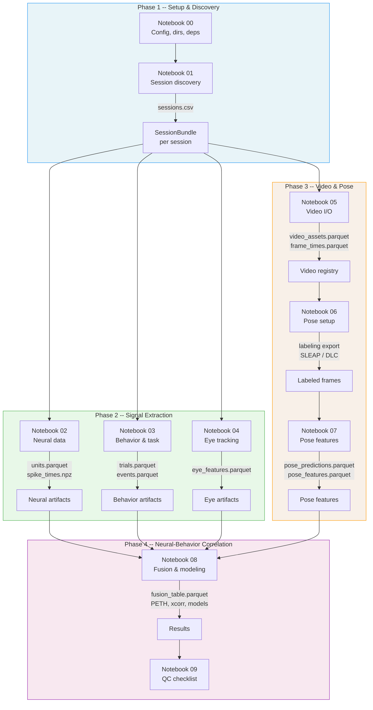

# Pipeline Overview

The VBN Analysis Suite processes Allen Institute Visual Behavior Neuropixels (VBN) data through four sequential phases, each building on the outputs of the previous one. Every artifact is written with a canonical **NWB-seconds timebase** and machine-readable provenance metadata, so downstream consumers never have to guess which clock a timestamp refers to.

---

## Data Flow Diagram



---

## Phase Summary

| Phase | Notebooks | Input | Output | Key Module(s) |
|-------|-----------|-------|--------|----------------|
| **1 -- Setup & Discovery** | 00, 01 | Environment, `sessions.csv` or `sessions.txt` | `SessionBundle` objects, config snapshot | `config`, `io_sessions` |
| **2 -- Signal Extraction** | 02, 03, 04 | NWB files (real or mock) | `units.parquet`, `spike_times.npz`, `trials.parquet`, `events.parquet`, `eye_features.parquet` | `io_nwb`, `features_task`, `features_eye` |
| **3 -- Video & Pose** | 05, 06, 07 | S3 video assets, SLEAP/DLC models | `video_assets.parquet`, `frame_times.parquet`, `pose_predictions.parquet`, `pose_features.parquet` | `io_video`, `features_pose`, `pose_inference` |
| **4 -- Neural-Behavior Correlation** | 08, 09 | All Phase 2 & 3 outputs | Fusion table, PETHs, cross-correlation, encoding/decoding models, Granger causality, QC report | `neural_events`, `cross_correlation`, `modeling` |

---

## Canonical Timebase

Every timestamped artifact in the pipeline uses **NWB seconds** -- the same clock that the Neuropixels hardware synchronizes to inside each NWB file. This means:

- Spike times, trial events, eye tracking samples, video frame timestamps, and pose predictions all share a single reference clock.
- Every parquet file carries a `timebase` field in its Parquet schema metadata **and** in a sidecar `.meta.json` file.
- You never need to convert between clocks when joining tables.

```json title="Example sidecar: session_1234567890_units.parquet.meta.json"
{
  "timebase": "nwb_seconds",
  "provenance": {
    "session_id": 1234567890,
    "code_version": "9e576ad",
    "created_at": "2026-03-09T12:00:00+00:00",
    "alignment_method": "nwb"
  }
}
```

---

## Artifact Caching

The pipeline uses a two-tier caching strategy:

1. **Output artifacts** (`outputs/neural/`, `outputs/behavior/`, etc.) are deterministic parquet files keyed by session ID. If the file exists on disk, it is loaded directly without re-extracting from NWB.
2. **Step cache** (`outputs/cache/session_<id>/`) uses `joblib` serialization keyed by an MD5 hash of the step parameters. This covers expensive intermediate computations.

```python title="How caching works under the hood"
def cache_step(session_id, step, params, compute_fn):
    path = _cache_path(session_id, step, params)  # (1)!
    if path.exists():
        return joblib.load(path)                   # (2)!
    result = compute_fn()
    joblib.dump(result, path)                      # (3)!
    return result
```

1. Path is `outputs/cache/session_<id>/<step>_<md5>.joblib`
2. Cache hit -- returns instantly
3. Cache miss -- compute, then persist for next time

---

## Next Steps

Dive into each phase for detailed, code-level walkthroughs:

- [Phase 1: Setup & Discovery](phase1-setup.md) -- configuration, session discovery, the `SessionBundle` dataclass
- [Phase 2: Signal Extraction](phase2-signals.md) -- neural, behavioral, and eye-tracking data extraction
- [Phase 3: Video & Pose](phase3-video-pose.md) -- video assets, SLEAP inference, pose feature engineering
- [Phase 4: Neural-Behavior Correlation](phase4-correlation.md) -- PETHs, cross-correlation, encoding/decoding models, Granger causality
